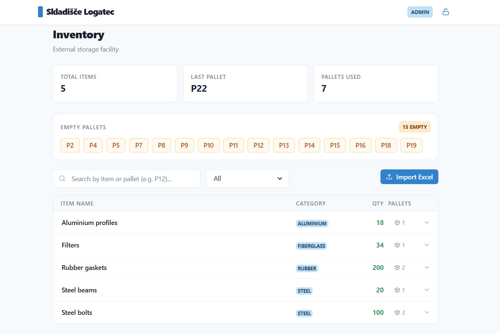
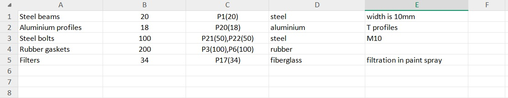
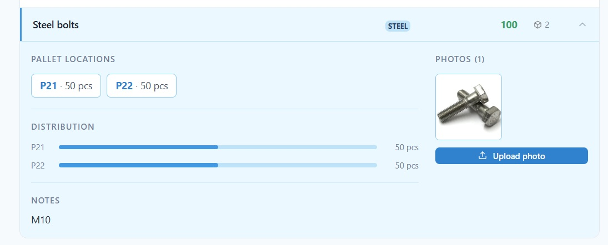
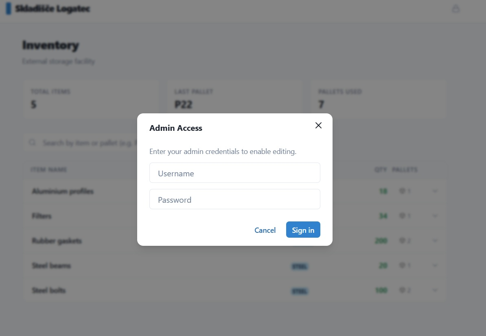

# Storage inventory

---

- Excel import with category and pallet parsing 
- Expandable inventory list with search by item name and pallet number 
- Pallet distribution bars 
- Multi-photo upload per item 
- Lightbox with arrows and photo counter 
- Delete photo on hover (admin only) 
- Toast notifications 
- JWT admin auth 
- MySQL database with proper relations

Import Excel file and it displays it. It's structure should be :

Item name | Qty | Pallet number with or without (qty) | description | notes

Example :

Steel beam | 10 | P23(10) | steel | width is 10mm

Username:admin password:admin123

---

---

---

---

